

  

<h1 align="center"><strong>Néto BOT</strong></h1>
<h3 align="center" style="color: gray; font-weight: normal;">- système de nettoyage intelligent à navigation autonome -</h3>

  <strong>Auteur :</strong> Aris-Georgian ILIE &nbsp;|&nbsp; 
  <strong>Faculté :</strong> Faculté d'Ingénierie en Langues Étrangères &nbsp;|&nbsp;
  <strong>Groupe :</strong> 1220 FA

---

## TABLE DES MATIÈRES

- [DESCRIPTION](#description)
- [MOTIVATION](#motivation)
- [ARCHITECTURE](#architecture)
  - [DIAGRAMME FONCTIONNEL](#diagramme-fonctionnel)
  - [SCHÉMA ÉLECTRIQUE](#schéma-électrique)
- [COMPOSANTS](#composants)
- [JOURNAL DE DÉVELOPPEMENT](#journal-de-développement)
- [BIBLIOTHÈQUES](#bibliothèques)
- [LIENS UTILES](#liens-utiles)

---

## DESCRIPTION

Néto BOT est un robot aspirateur autonome contrôlé par un microcontrôleur ESP32. Il est conçu pour détecter les obstacles à l’aide d’un capteur à ultrasons monté sur un servomoteur et contourner automatiquement ces obstacles en adaptant sa trajectoire. Il est équipé d’un système de ventilation assurant l’aspiration des poussières et peut être commandé soit en mode automatique, soit manuellement via une interface Wi-Fi. Tous les composants matériels - L298N, moteurs, ventilateurs, batteries - sont intégrés sur une structure mobile légère et modulaire, optimisée pour les surfaces planes intérieures.

---

## MOTIVATION

Le projet s’inscrit dans une démarche d’apprentissage appliqué de la robotique domestique et de l’IoT. Il vise à reproduire à moindre coût le fonctionnement des robots aspirateurs commerciaux, en utilisant des composants standards accessibles. Ce robot permet d’explorer la logique de navigation autonome, les systèmes embarqués et la communication Wi-Fi en vue d’un pilotage ou d’un retour d’état à distance. C’est un projet éducatif polyvalent, à forte valeur d’expérimentation.

---

## ARCHITECTURE

### DIAGRAMME FONCTIONNEL

  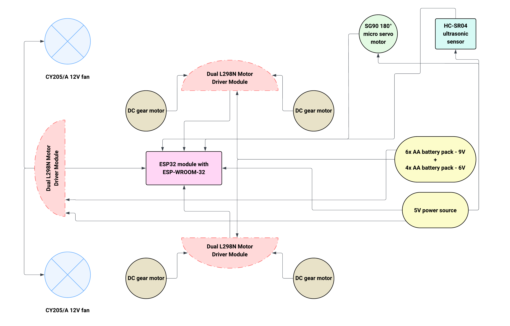

Le <strong>diagramme fonctionnel</strong> illustre de manière abstraite l'organisation logique du système. Il met en évidence les principales fonctions du robot ainsi que les flux d'information entre les composants. Ce schéma est essentiel pour comprendre la répartition des rôles au sein du robot et la manière dont les différents modules interagissent pour remplir la tâche de nettoyage autonome.

---

### SCHÉMA ÉLECTRIQUE

  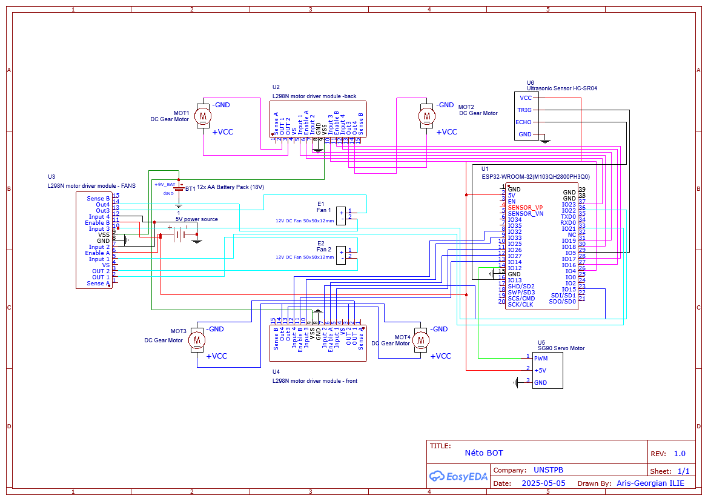

Le <strong>schéma électrique</strong> représente le câblage réel de l’ensemble des composants du robot, incluant les connexions entre l’ESP32, les moteurs, le module L298N, les capteurs, les alimentations et les ventilateurs. Ce schéma est fondamental pour le montage physique du robot et sert de référence lors du prototypage, du dépannage ou de la reproduction du projet.

---

## COMPOSANTS

<table>
  <thead>
    <tr>
      <th><strong>Produit</strong></th>
      <th><strong>Quantité</strong></th>
      <th><strong>Prix unitaire</strong></th>
      <th><strong>Prix total</strong></th>
      <th><strong>Utilisation</strong></th>
    </tr>
  </thead>
  <tbody>
    <tr>
      <td align="center"><a href="https://www.optimusdigital.ro/ro/componente-electronice-altele/4359-mufa-dc-pentru-carcasa-interior-de-55-mm-pin-de-21-mm.html?search_query=Mufa+DC+pentru+Carcasa+%28Interior+de+5.5+mm%2C+Pin+de+2.1+mm%29+&results=1">Connecteur DC pour boîtier</a></td>
      <td align="center">2</td>
      <td align="center">0,87 lei</td>
      <td align="center">1,74 lei</td>
      <td align="justify">Interface d’alimentation externe sécurisée.</td>
    </tr>
    <tr>
      <td align="center"><a href="https://www.optimusdigital.ro/ro/prototipare-breadboard-uri/44-breadboard-400-points.html?search_query=Breadboard+HQ+%28400+Points%29+&results=1">Breadboard HQ (400 points)</a></td>
      <td align="center">1</td>
      <td align="center">4,56 lei</td>
      <td align="center">4,56 lei</td>
      <td align="justify">Prototypage sans soudure des circuits électroniques.</td>
    </tr>
    <tr>
      <td align="center"><a href="https://www.optimusdigital.ro/ro/fire-fire-mufate/884-set-fire-tata-tata-40p-10-cm.html?search_query=Fire+Colorate+Tata-Tata+%2840p%2C+10+cm%29+&results=10">Fils Dupont Mâle-Mâle (40p, 10 cm)</a></td>
      <td align="center">1</td>
      <td align="center">4,99 lei</td>
      <td align="center">4,99 lei</td>
      <td align="justify">Connexion directe entre broches GPIO.</td>
    </tr>
    <tr>
      <td align="center"><a href="https://www.optimusdigital.ro/ro/fire-fire-mufate/881-set-fire-mama-mama-40p-15-cm.html?search_query=Fire+Colorate+Mama-Mama+%2840p%2C+15+cm%29+&results=10">Fils Dupont Femelle-Femelle (40p, 15 cm)</a></td>
      <td align="center">1</td>
      <td align="center">6,99 lei</td>
      <td align="center">6,99 lei</td>
      <td align="justify">Connexion entre modules ou capteurs femelles.</td>
    </tr>
    <tr>
      <td align="center"><a href="https://www.optimusdigital.ro/ro/fire-fire-mufate/878-set-fire-mama-tata-40p-30-cm.html?search_query=Fire+Colorate+Mama-Tata+%2840p%2C+30+cm%29+&results=5">Fils Dupont Mâle-Femelle (40p, 30 cm)</a></td>
      <td align="center">2</td>
      <td align="center">4,81 lei</td>
      <td align="center">9,62 lei</td>
      <td align="justify">Interconnexion flexible entre cartes et modules.</td>
    </tr>
    <tr>
      <td align="center"><a href="https://www.optimusdigital.ro/ro/motoare-servomotoare/2261-micro-servo-motor-sg90-180.html?search_query=Micro+Servomotor+SG90+180%C2%B0+&results=2">Micro Servomoteur SG90 180°</a></td>
      <td align="center">1</td>
      <td align="center">11,99 lei</td>
      <td align="center">11,99 lei</td>
      <td align="justify">Permet l’orientation du capteur à ultrasons (balayage angulaire).</td>
    </tr>
    <tr>
      <td align="center"><a href="https://www.emag.ro/cablu-date-si-incarcare-baseus-cafule-camklf-bg1-usb-la-microusb-1m-2-4a-negru-gri-6953156280335/pd/DNXNN8MBM/">Câble USB à MicroUSB (CAMKLF-BG1)</a></td>
      <td align="center">1</td>
      <td align="center">13,48 lei</td>
      <td align="center">13,48 lei</td>
      <td align="justify">Utilisé pour alimenter et programmer la carte ESP32 via USB.</td>
    </tr>
    <tr>
      <td align="center"><a href="https://www.optimusdigital.ro/ro/suporturi-de-baterii/12571-suport-pentru-6-baterii-aa-fara-capac.html?search_query=Suport+pentru+6+baterii+AA+fara+capac+&results=1">Support pour 6 piles AA</a></td>
      <td align="center">2</td>
      <td align="center">8,98 lei</td>
      <td align="center">17,96 lei</td>
      <td align="justify">Alimentation modulaire de 9V pour moteurs.</td>
    </tr>
    <tr>
      <td align="center"><a href="https://www.optimusdigital.ro/ro/accesorii-altele/7962-ventilator-cy205a-12-v-80x80x25-mm.html?search_query=Ventilator+CY205%2FA+12+V+80x80x25+mm+&results=1">Ventilateur CY205/A 12 V 80×80×25 mm</a></td>
      <td align="center">2</td>
      <td align="center">8,99 lei</td>
      <td align="center">17,98 lei</td>
      <td align="justify">Génère une aspiration d’air pour la fonction de nettoyage par succion.</td>
    </tr>
    <tr>
      <td align="center"><a href="https://www.optimusdigital.ro/ro/drivere-de-motoare-cu-perii/145-driver-de-motoare-dual-l298n.html?search_query=Modul+cu+Driver+de+Motoare+Dual+L298N+Rosu+&results=1">Module avec Driver de Moteurs Double L298N</a></td>
      <td align="center">3</td>
      <td align="center">10,99 lei</td>
      <td align="center">32,97 lei</td>
      <td align="justify">Contrôle indépendant de deux moteurs DC par module.</td>
    </tr>
    <tr>
      <td align="center"><a href="https://altex.ro/baterii-alcaline-basic-duracell-aa-6-bucati/cpd/BATBASICAAK6/">Piles AA</a></td>
      <td align="center">12</td>
      <td align="center">3,60 lei</td>
      <td align="center">43,20 lei</td>
      <td align="justify">Source d’énergie autonome pour modules électroniques.</td>
    </tr>
    <tr>
      <td align="center"><a href="https://www.emag.ro/placa-esp32-cu-esp-wroom-32-38-pini-cu-cip-cp2102-multicolor-esp32-cp2102/pd/D7R798MBM/?ref=history-shopping_416932438_112784_1">Carte ESP32 avec module ESP-WROOM-32</a></td>
      <td align="center">1</td>
      <td align="center">57,96 lei</td>
      <td align="center">57,96 lei</td>
      <td align="justify">Microcontrôleur central assurant la logique, les capteurs et la connectivité Wi-Fi/Bluetooth.</td>
    </tr>
    <tr>
      <td align="center"><a href="https://www.optimusdigital.ro/ro/motoare-altele/139-motor-cu-reductor-si-roata.html?search_query=Motor+cu+reductor+si+roata+&results=18">Moteur avec réducteur et roue</a></td>
      <td align="center">4</td>
      <td align="center">14,99 lei</td>
      <td align="center">59,96 lei</td>
      <td align="justify">Permet la mobilité du robot avec force de traction suffisante.</td>
    </tr>
    <tr>
      <td colspan="3" align="right"><strong>Total général</strong></td>
      <td align="center"><strong>331,58 lei</strong></td>
      <td></td>
    </tr>
  </tbody>
</table>

---

## JOURNAL DE DÉVELOPPEMENT

#### Semaine 1 – 12 Mai

<table>
  <tr>
    <td style="width: 45%;">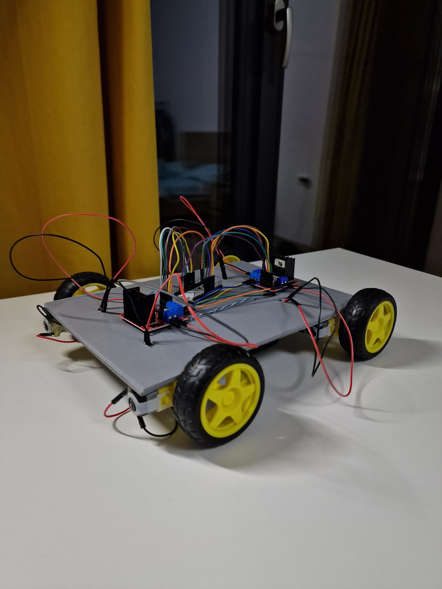</td>
    <td style="vertical-align:top; text-align:justify; padding-left:15px;">
      La première étape a consisté à fixer les roues sur la plaque de base du robot. J’ai percé les trous nécessaires pour faire passer les fils des moteurs. Ensuite, j’ai connecté les moteurs aux deux pilotes de moteur L298N: un pour les roues avant et un pour les roues arrière. Chaque pilote a été relié à la carte ESP32 afin d’assurer le contrôle complet de la mobilité.
    </td>
  </tr>
  <tr>
    <td style="vertical-align:top; text-align:justify; padding-right:15px;">
      Dans la deuxième étape, j’ai ajouté une breadboard sur la base pour faciliter les connexions électriques. J’ai également vissé quatre longues vis qui serviront à soutenir un second niveau. Ce deuxième étage accueillera le système d’alimentation -  les piles, ainsi que le système d’aspiration.
    </td>
    <td style="width: 45%;">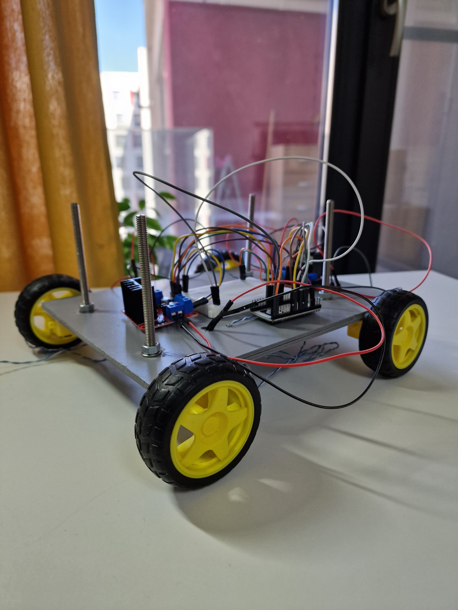</td>
  </tr>
  <tr>
    <td style="width: 45%;">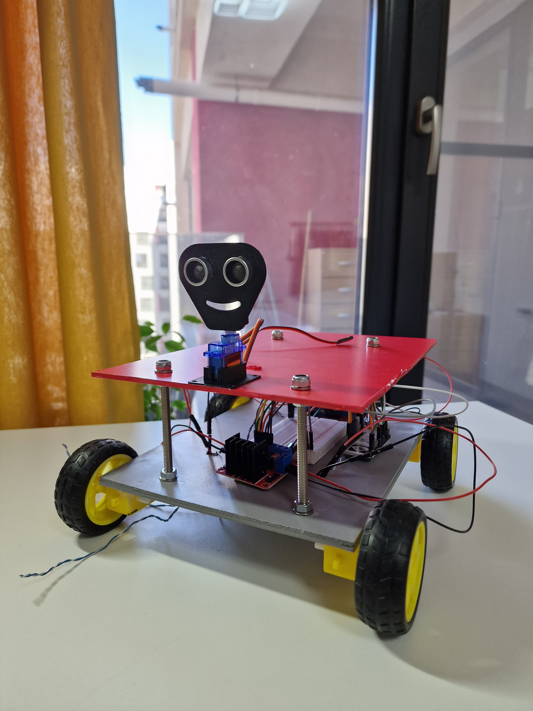</td>
    <td style="vertical-align:top; text-align:justify; padding-left:15px;">
      La troisième photo montre le montage du deuxième niveau du robot. J’y ai fixé un servomoteur sur lequel j’ai installé un capteur à ultrasons grâce à un support spécial en plastique. Cette configuration permet la rotation du capteur pour effectuer des balayages angulaires en mode autonome.
    </td>
  </tr>
  <tr>
    <td style="vertical-align:top; text-align:justify; padding-right:15px;">
      À ce stade avancé, comme on le voit sur la quatrième image, j’ai ajouté un troisième pilote L298N dédié au contrôle des deux ventilateurs. Les connexions nécessaires avec la breadboard ont été effectuées pour distribuer l’alimentation à partir des deux supports de six piles AA. En plus, une batterie externe a été fixée sous la base du robot à l’aide de câbles, fournissant du courant de 5V à la breadboard.
    </td>
    <td style="width: 45%;">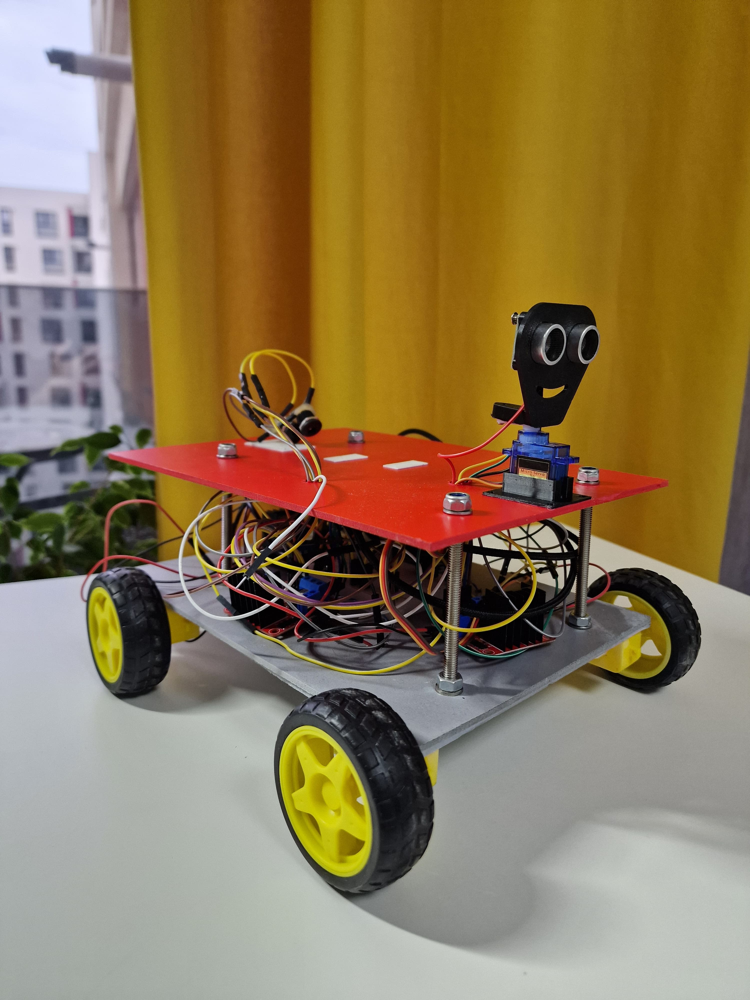</td>
  </tr>
  <tr>
    <td style="width: 45%;">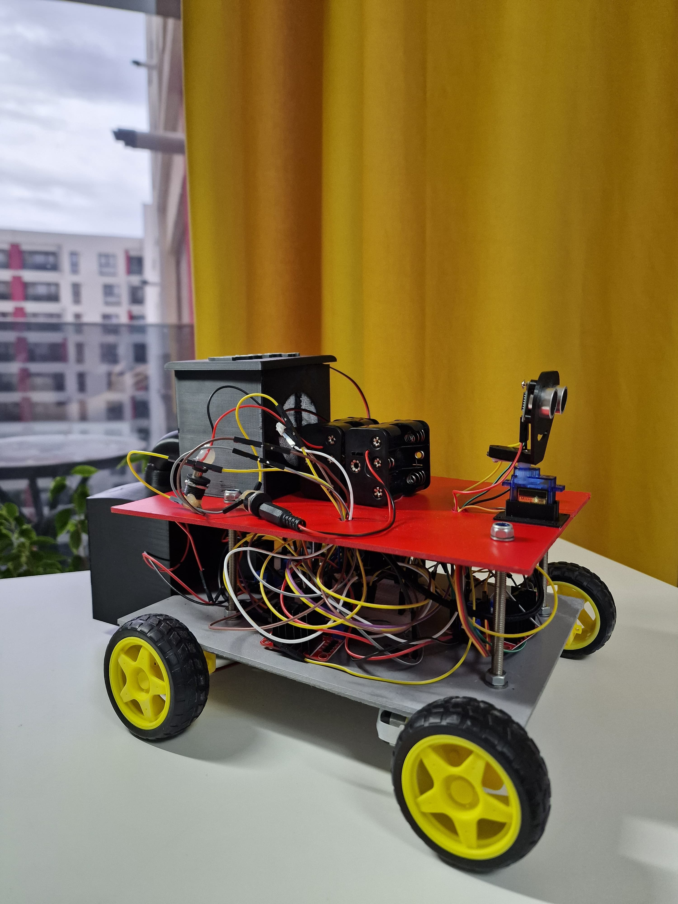</td>
    <td style="vertical-align:top; text-align:justify; padding-left:15px;">
      La cinquième photo présente l’état final du robot. Le système d’aspiration imprimé en 3D a été installé: il comprend les deux ventilateurs internes connectés au circuit, ainsi qu’un filtre à poussière visible sur l’image. Les deux supports de batteries ont également été ajoutés et tous les circuits ont été finalisés, avec les composants correctement branchés et fixés. Le robot est maintenant prêt à être programmé.
    </td>
  </tr>
</table>

<!-- Ajout des images 3D du système d'aspiration -->

  <table style="width:100%; text-align:center;">
    <tr>
      <td>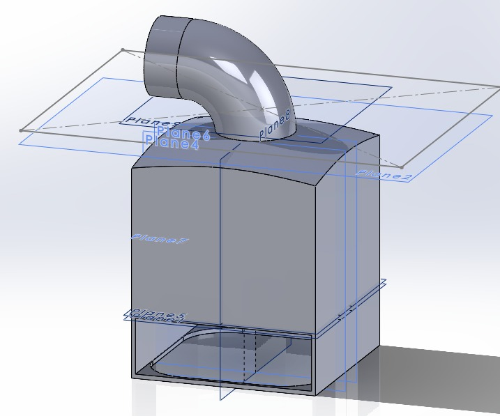</td>
      <td>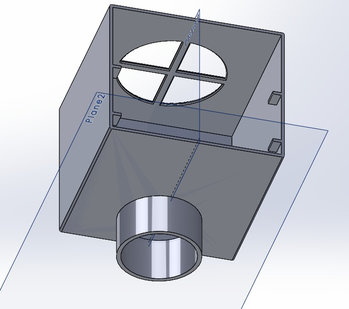</td>
      <td>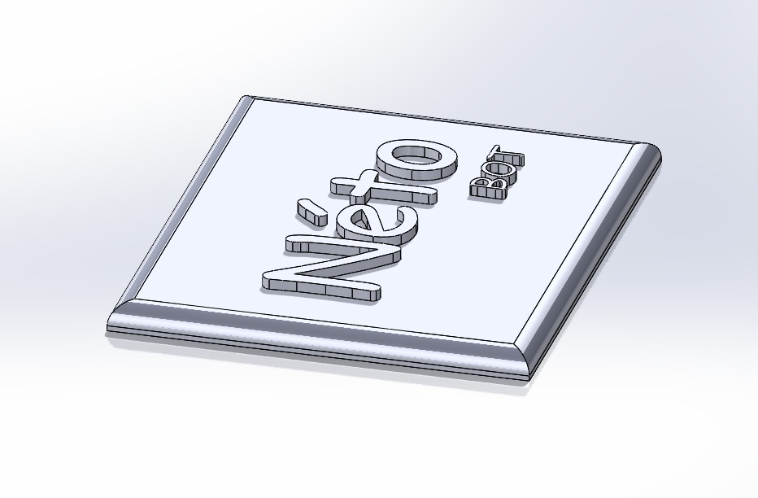</td>
    </tr>
    <tr>
      <td colspan="3" style="padding-top:10px; text-align:justify;">
        Les images ci-dessus représentent le modèle 3D du système d’aspiration conçu dans le logiciel SOLIDWORKS. Ce système est composé de trois pièces principales conçues pour s’assembler facilement. La première pièce est le tuyau incurvé chargé de l’aspiration de l’air, dans lequel est intégré le premier ventilateur. La deuxième pièce est une chambre centrale qui stocke la poussière; elle contient également le deuxième ventilateur et dispose d’une ouverture conçue pour permettre la dépressurisation de l’air. Enfin, la troisième pièce est un couvercle esthétique, gravé du nom du robot « Néto BOT », qui vient se fixer sur le dessus de la chambre.
      </td>
    </tr>
  </table>

#### Semaine 13 – 19 Mai

Cette deuxième semaine de travail a été dédiée à la programmation complète du robot. J’ai intégré tous les composants matériels à travers un code structuré et optimisé. L’objectif a été de garantir un fonctionnement fluide en mode manuel et autonome, tout en développant une interface web intuitive pour piloter le robot. De nombreux tests ont été réalisés pour s'assurer de la robustesse du système.

<table style="width:100%; table-layout: fixed;">
  <tr>
    <td style="width: 45%; font-family: monospace; background-color:#f4f4f4; padding:10px; border-radius:6px; word-wrap: break-word;">
// Déclaration des bibliothèques 
#include &lt;WiFi.h&gt; 
#include &lt;WebServer.h&gt; 
#include &lt;ESP32Servo.h&gt;  
// Réseau Wi-Fi 
const char* ssid = "TP-Link_XXXXX"; 
const char* password = "XXXXXXX";
    </td>
    <td style="vertical-align:top; text-align:justify; padding-left:15px;">
      La première étape du code consiste à inclure les bibliothèques nécessaires à la communication Wi-Fi, au serveur web embarqué et au contrôle du servomoteur. Ces éléments sont essentiels pour interagir avec le robot à distance.
    </td>
  </tr>

  <tr>
    <td style="vertical-align:top; text-align:justify; padding-right:15px;">
      Cette section configure les broches GPIO utilisées pour les moteurs, ventilateurs, capteurs et servomoteur. Chaque broche est adaptée à l’architecture physique du robot.
    </td>
    <td style="width: 45%; font-family: monospace; background-color:#f4f4f4; padding:10px; border-radius:6px; word-wrap: break-word;">
// Broches des moteurs 
const int motorFataA1 = 26; 
const int motorFataA2 = 15; 
... 
// Capteur ultrasons 
const int trigPin = 5; 
const int echoPin = 13;
    </td>
  </tr>

  <tr>
    <td style="width: 45%; font-family: monospace; background-color:#f4f4f4; padding:10px; border-radius:6px; word-wrap: break-word;">
void setup() { 
  Serial.begin(115200); 
  pinMode(motorFataA1, OUTPUT); 
  ... 
  WiFi.begin(ssid, password); 
  server.begin(); 
}
    </td>
    <td style="vertical-align:top; text-align:justify; padding-left:15px;">
      La fonction <code>setup()</code> initialise tous les composants matériels et connecte le robot au Wi-Fi. Elle prépare également le serveur pour recevoir des requêtes HTTP.
    </td>
  </tr>

  <tr>
    <td style="vertical-align:top; text-align:justify; padding-right:15px;">
      Ces fonctions contrôlent les déplacements: avant, arrière, gauche, droite. Elles utilisent le PWM pour la vitesse et les sorties logiques pour la direction.
    </td>
    <td style="width: 45%; font-family: monospace; background-color:#f4f4f4; padding:10px; border-radius:6px; word-wrap: break-word;">
void mersInainte() { 
  int vitezaPWM = vitezaMotoare * 255; 
  analogWrite(motorFataA_EN, vitezaPWM); 
  digitalWrite(motorFataA1, LOW); 
  digitalWrite(motorFataA2, HIGH); 
  ... 
}
    </td>
  </tr>

  <tr>
    <td style="width: 45%; font-family: monospace; background-color:#f4f4f4; padding:10px; border-radius:6px; word-wrap: break-word;">
long masoareDistanta() { 
  digitalWrite(trigPin, LOW); 
  delayMicroseconds(2); 
  digitalWrite(trigPin, HIGH); 
  delayMicroseconds(10); 
  digitalWrite(trigPin, LOW); 
  long durata = pulseIn(echoPin, HIGH, 30000); 
  ... 
}
    </td>
    <td style="vertical-align:top; text-align:justify; padding-left:15px;">
      Cette fonction lit les distances avec le capteur à ultrasons. Elle est utilisée pour la détection d'obstacles et pour ajuster automatiquement le comportement du robot.
    </td>
  </tr>

  <tr>
    <td style="vertical-align:top; text-align:justify; padding-right:15px;">
      La logique autonome repose sur cette fonction. Elle déclenche des virages ou reculs en fonction des obstacles détectés à l’avant, à gauche ou à droite.
    </td>
    <td style="width: 45%; font-family: monospace; background-color:#f4f4f4; padding:10px; border-radius:6px; word-wrap: break-word;">
void gestionModAutonom() { 
  if (distanta &lt; 15) { 
    stareAutonoma = MERS_INAPOI; 
  } else { 
    ... 
  } 
}
    </td>
  </tr>

  <tr>
    <td style="width: 45%; font-family: monospace; background-color:#f4f4f4; padding:10px; border-radius:6px; word-wrap: break-word;">
server.on("/", HTTP_GET,  { 
  String html = "&lt;html&gt;...&lt;/html&gt;"; 
  server.send(200, "text/html", html); 
});
    </td>
    <td style="vertical-align:top; text-align:justify; padding-left:15px;">
      Cette partie génère dynamiquement l'interface Web. Elle permet de piloter le robot via Wi-Fi, d’afficher la distance détectée et de modifier la vitesse ou l’orientation.
    </td>
  </tr>

  <tr>
    <td style="vertical-align:top; text-align:justify; padding-right:15px;">
      La boucle principale met à jour la distance mesurée et appelle <code>gestionModAutonom()</code> si le robot est en mode autonome. Elle traite également les requêtes du serveur.
    </td>
    <td style="width: 45%; font-family: monospace; background-color:#f4f4f4; padding:10px; border-radius:6px; word-wrap: break-word;">
void loop() { 
  server.handleClient(); 
  if (millis() - ultimaMasurareDistanta &gt;= intervalMasurare) { 
    distanta = masoareDistanta(); 
  } 
  if (modAutonom) gestionModAutonom(); 
}
    </td>
  </tr>

  <tr>
    <td style="width: 45%;">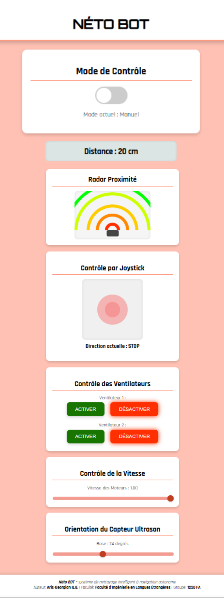</td>
    <td style="vertical-align:top; text-align:justify; padding-left:15px;">
      L’interface web du robot « NÉTO BOT » permet un contrôle complet et intuitif. Elle comprend un bouton pour basculer entre les modes manuel et autonome, un affichage de la distance en temps réel avec un radar visuel, un joystick pour la navigation manuelle, des boutons pour activer ou désactiver les ventilateurs, ainsi que deux curseurs pour ajuster la vitesse des moteurs et l’orientation du capteur à ultrasons.
    </td>
  </tr>
</table>

#### Semaine 20 – 26 Mai

Durant cette dernière semaine, je me suis concentré sur la documentation complète du projet. J’ai mis à jour la page GitHub dédiée au robot, en y ajoutant l’ensemble des fichiers nécessaires ainsi que des explications claires sur le fonctionnement du système. J’ai également veillé à structurer la documentation de manière cohérente, en détaillant toutes les étapes importantes de développement et les jalons atteints au cours du projet. L’objectif était de garantir que toute personne consultant le projet puisse comprendre son évolution, sa logique de conception, ainsi que les choix techniques effectués.

---

## BIBLIOTHÈQUES

<table>
  <thead>
    <tr>
      <th><strong>Bibliothèque</strong></th>
      <th><strong>Description</strong></th>
      <th><strong>Utilisation dans le projet</strong></th>
    </tr>
  </thead>
  <tbody>
    <tr>
      <td><a href="https://github.com/espressif/arduino-esp32/tree/master/libraries/WiFi">WiFi.h</a></td>
      <td align="justify">Bibliothèque officielle ESP32 pour la gestion de la connexion sans fil (Wi-Fi), permettant de se connecter à un réseau local (WLAN).</td>
      <td align="justify">Utilisée pour connecter le robot à un réseau Wi-Fi local, afin de permettre l’accès à l’interface de commande à distance via navigateur web.</td>
    </tr>
    <tr>
      <td><a href="https://github.com/espressif/arduino-esp32/tree/master/libraries/WebServer">WebServer.h</a></td>
      <td align="justify">Fournit un serveur HTTP embarqué permettant de créer des routes GET et POST pour interagir avec l’ESP32 via une page web.</td>
      <td align="justify">Utilisée pour héberger une interface web de commande manuelle, permettant de contrôler le robot, la vitesse, les ventilateurs et de lire la distance.</td>
    </tr>
    <tr>
      <td><a href="https://github.com/espressif/arduino-esp32/tree/master/libraries/ESP32Servo">ESP32Servo.h</a></td>
      <td align="justify">Permet le contrôle précis de servomoteurs avec les minuteries compatibles ESP32 (PWM matériel logiciel).</td>
      <td align="justify">Utilisée pour orienter un capteur à ultrasons monté sur un servomoteur afin de scanner l’environnement dans le mode autonome.</td>
    </tr>
  </tbody>
</table>

---

## LIENS UTILES

##### **Vidéos de projets similaires**

- [Autonomous Vacuum Cleaner DIY Project – How It Works](https://www.youtube.com/watch?v=iOrvGC9REEE)
- [Robot Aspirateur fait maison (système complet)](https://www.youtube.com/watch?v=n8C8cyyUXuY)
- [Build an Obstacle Avoiding Robot Using Arduino and Ultrasonic](https://www.youtube.com/watch?v=UU7VVbEZulw)
- [#vacuumcleanerscienceproject (inspirations scientifiques)](https://www.youtube.com/watch?v=hHIIWpZcYNs&pp=ygUcI3ZhY2N1bWNsZWFuZXJzY2llbmNlcHJvamVjdA%3D%3D)

---

##### **Tutoriels techniques (composants)**

- [ESP32 Pinout and Configuration Guide](https://randomnerdtutorials.com/esp32-pinout-reference-gpios/)
- [How to Use the L298N Motor Driver Module](https://lastminuteengineers.com/l298n-dc-stepper-driver-arduino-tutorial/)
- [Ultrasonic Sensor HC-SR04 – How it Works & How to Use](https://randomnerdtutorials.com/complete-guide-for-ultrasonic-sensor-hc-sr04/)
  
---

##### **Documentation officielle & fiches techniques**

- [ESP32 Datasheet (Espressif)](https://www.espressif.com/sites/default/files/documentation/esp32_datasheet_en.pdf)
- [L298N Motor Driver Datasheet](https://www.st.com/resource/en/datasheet/l298.pdf)
- [HC-SR04 Sensor Datasheet](https://cdn.sparkfun.com/datasheets/Sensors/Proximity/HCSR04.pdf)

---

##### **Articles scientifiques & applications robotiques**

- [Low-cost Autonomous Vacuum Cleaner: A Hardware Perspective – ResearchGate](https://www.researchgate.net/publication/348364379_Low-cost_Autonomous_Vacuum_Cleaner_A_Hardware_Perspective)

