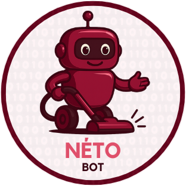

  

<h1 align="center"><strong>Néto BOT</strong></h1>
<h3 align="center" style="color: gray; font-weight: normal;">robot de nettoyage autonome</h3>

  <strong>Auteur :</strong> Aris-Georgian ILIE &nbsp;|&nbsp; 
  <strong>Faculté :</strong> Faculté d'Ingénierie en Langues Étrangères &nbsp;|&nbsp;
  <strong>Groupe :</strong> 1220 FA

---

## TABLE DES MATIÈRES

- [DESCRIPTION](#description)
- [MOTIVATION](#motivation)
- [ARCHITECTURE](#architecture)
  - [DIAGRAMME FONCTIONNEL](#diagramme-fonctionnel)
  - [SCHÉMA ÉLECTRIQUE](#schéma-électrique)
- [COMPOSANTS](#composants)
- [BIBLIOTHÈQUES](#bibliothèques)
- [JOURNAL DE DÉVELOPPEMENT](#journal-de-développement)
- [LIENS UTILES](#liens-utiles)

---

## DESCRIPTION

Néto BOT est un robot autonome conçu pour détecter les obstacles et effectuer le nettoyage de surfaces planes. Il utilise des capteurs à ultrasons, un système de pulvérisation d’eau, et une structure motorisée commandée par microcontrôleur.

---

## MOTIVATION

Ce projet combine électronique embarquée, programmation Arduino et robotique pratique, pour créer un robot utile, efficace et éducatif, tout en explorant les défis liés à l’automatisation mobile.

---

## ARCHITECTURE

### DIAGRAMME FONCTIONNEL

  

### SCHÉMA ÉLECTRIQUE

  

---

## COMPOSANTS

<table>
  <thead>
    <tr>
      <th><strong>Produit</strong></th>
      <th><strong>Quantité</strong></th>
      <th><strong>Prix unitaire</strong></th>
      <th><strong>Prix total</strong></th>
      <th><strong>Utilisation</strong></th>
    </tr>
  </thead>
  <tbody>
    <tr>
      <td align="center"><a href="https://www.optimusdigital.ro/ro/componente-electronice-altele/4359-mufa-dc-pentru-carcasa-interior-de-55-mm-pin-de-21-mm.html?search_query=Mufa+DC+pentru+Carcasa+%28Interior+de+5.5+mm%2C+Pin+de+2.1+mm%29+&results=1">Connecteur DC pour boîtier</a></td>
      <td align="center">2</td>
      <td align="center">0,87 lei</td>
      <td align="center">1,74 lei</td>
      <td align="justify">Interface d’alimentation externe sécurisée.</td>
    </tr>
    <tr>
      <td align="center"><a href="https://www.optimusdigital.ro/ro/prototipare-breadboard-uri/44-breadboard-400-points.html?search_query=Breadboard+HQ+%28400+Points%29+&results=1">Breadboard HQ (400 points)</a></td>
      <td align="center">1</td>
      <td align="center">4,56 lei</td>
      <td align="center">4,56 lei</td>
      <td align="justify">Prototypage sans soudure des circuits électroniques.</td>
    </tr>
    <tr>
      <td align="center"><a href="https://www.optimusdigital.ro/ro/fire-fire-mufate/884-set-fire-tata-tata-40p-10-cm.html?search_query=Fire+Colorate+Tata-Tata+%2840p%2C+10+cm%29+&results=10">Fils Dupont Mâle-Mâle (40p, 10 cm)</a></td>
      <td align="center">1</td>
      <td align="center">4,99 lei</td>
      <td align="center">4,99 lei</td>
      <td align="justify">Connexion directe entre broches GPIO.</td>
    </tr>
    <tr>
      <td align="center"><a href="https://sigmanortec.ro/Suport-Baterii-4AA-cu-Mufa-p148578749">Support pour 4 piles AA avec connecteur</a></td>
      <td align="center">1</td>
      <td align="center">5,34 lei</td>
      <td align="center">5,34 lei</td>
      <td align="justify">Support d’alimentation portable à 6V.</td>
    </tr>
    <tr>
      <td align="center"><a href="https://www.optimusdigital.ro/ro/fire-fire-mufate/881-set-fire-mama-mama-40p-15-cm.html?search_query=Fire+Colorate+Mama-Mama+%2840p%2C+15+cm%29+&results=10">Fils Dupont Femelle-Femelle (40p, 15 cm)</a></td>
      <td align="center">1</td>
      <td align="center">6,99 lei</td>
      <td align="center">6,99 lei</td>
      <td align="justify">Connexion entre modules ou capteurs femelles.</td>
    </tr>
    <tr>
      <td align="center"><a href="https://www.optimusdigital.ro/ro/fire-fire-mufate/878-set-fire-mama-tata-40p-30-cm.html?search_query=Fire+Colorate+Mama-Tata+%2840p%2C+30+cm%29+&results=5">Fils Dupont Mâle-Femelle (40p, 30 cm)</a></td>
      <td align="center">2</td>
      <td align="center">4,81 lei</td>
      <td align="center">9,62 lei</td>
      <td align="justify">Interconnexion flexible entre cartes et modules.</td>
    </tr>
    <tr>
      <td align="center"><a href="https://www.optimusdigital.ro/ro/motoare-servomotoare/2261-micro-servo-motor-sg90-180.html?search_query=Micro+Servomotor+SG90+180%C2%B0+&results=2">Micro Servomoteur SG90 180°</a></td>
      <td align="center">1</td>
      <td align="center">11,99 lei</td>
      <td align="center">11,99 lei</td>
      <td align="justify">Permet l’orientation du capteur à ultrasons (balayage angulaire).</td>
    </tr>
    <tr>
      <td align="center"><a href="https://www.emag.ro/cablu-date-si-incarcare-baseus-cafule-camklf-bg1-usb-la-microusb-1m-2-4a-negru-gri-6953156280335/pd/DNXNN8MBM/">Câble USB à MicroUSB (CAMKLF-BG1)</a></td>
      <td align="center">1</td>
      <td align="center">13,48 lei</td>
      <td align="center">13,48 lei</td>
      <td align="justify">Utilisé pour alimenter et programmer la carte ESP32 via USB.</td>
    </tr>
    <tr>
      <td align="center"><a href="https://www.optimusdigital.ro/ro/suporturi-de-baterii/12571-suport-pentru-6-baterii-aa-fara-capac.html?search_query=Suport+pentru+6+baterii+AA+fara+capac+&results=1">Support pour 6 piles AA</a></td>
      <td align="center">1</td>
      <td align="center">8,98 lei</td>
      <td align="center">8,98 lei</td>
      <td align="justify">Alimentation modulaire de 9V pour moteurs.</td>
    </tr>
    <tr>
      <td align="center"><a href="https://www.optimusdigital.ro/ro/accesorii-altele/7962-ventilator-cy205a-12-v-80x80x25-mm.html?search_query=Ventilator+CY205%2FA+12+V+80x80x25+mm+&results=1">Ventilateur CY205/A 12 V 80×80×25 mm</a></td>
      <td align="center">2</td>
      <td align="center">8,99 lei</td>
      <td align="center">17,98 lei</td>
      <td align="justify">Génère une aspiration d’air pour la fonction de nettoyage par succion.</td>
    </tr>
    <tr>
      <td align="center"><a href="https://www.optimusdigital.ro/ro/drivere-de-motoare-cu-perii/145-driver-de-motoare-dual-l298n.html?search_query=Modul+cu+Driver+de+Motoare+Dual+L298N+Rosu+&results=1">Module avec Driver de Moteurs Double L298N</a></td>
      <td align="center">3</td>
      <td align="center">10,99 lei</td>
      <td align="center">32,97 lei</td>
      <td align="justify">Contrôle indépendant de deux moteurs DC par module.</td>
    </tr>
    <tr>
      <td align="center"><a href="https://altex.ro/baterii-alcaline-basic-duracell-aa-6-bucati/cpd/BATBASICAAK6/">Piles AA</a></td>
      <td align="center">10</td>
      <td align="center">3,60 lei</td>
      <td align="center">36,00 lei</td>
      <td align="justify">Source d’énergie autonome pour modules électroniques.</td>
    </tr>
    <tr>
      <td align="center"><a href="https://www.emag.ro/placa-esp32-cu-esp-wroom-32-38-pini-cu-cip-cp2102-multicolor-esp32-cp2102/pd/D7R798MBM/?ref=history-shopping_416932438_112784_1">Carte ESP32 avec module ESP-WROOM-32</a></td>
      <td align="center">1</td>
      <td align="center">57,96 lei</td>
      <td align="center">57,96 lei</td>
      <td align="justify">Microcontrôleur central assurant la logique, les capteurs et la connectivité Wi-Fi/Bluetooth.</td>
    </tr>
    <tr>
      <td align="center"><a href="https://www.optimusdigital.ro/ro/motoare-altele/139-motor-cu-reductor-si-roata.html?search_query=Motor+cu+reductor+si+roata+&results=18">Moteur avec réducteur et roue</a></td>
      <td align="center">4</td>
      <td align="center">14,99 lei</td>
      <td align="center">59,96 lei</td>
      <td align="justify">Permet la mobilité du robot avec force de traction suffisante.</td>
    </tr>
    <tr>
      <td colspan="3" align="right"><strong>Total général</strong></td>
      <td align="center"><strong>328,12 lei</strong></td>
      <td></td>
    </tr>
  </tbody>
</table>

---

## BIBLIOTHÈQUES

<table>
  <thead>
    <tr>
      <th><strong>Bibliothèque</strong></th>
      <th><strong>Description</strong></th>
      <th><strong>Utilisation</strong></th>
    </tr>
  </thead>
  <tbody>
    <tr>
      <td><a href="https://bitbucket.org/teckel12/arduino-new-ping/wiki/Home">NewPing</a></td>
      <td align="justify">Bibliothèque légère et rapide permettant d’utiliser efficacement les capteurs à ultrasons HC-SR04 sans bloquer le microcontrôleur.</td>
      <td align="justify">Mesure précise des distances à l’aide des capteurs à ultrasons, utilisée pour la détection d’obstacles et la navigation autonome.</td>
    </tr>
    <tr>
      <td><a href="https://www.arduino.cc/en/Reference/LiquidCrystal">LiquidCrystal</a></td>
      <td align="justify">Bibliothèque native Arduino permettant le contrôle des écrans LCD alphanumériques 16x2 ou 20x4 à base de contrôleur HD44780.</td>
      <td align="justify">Affichage en temps réel des messages, alertes et états internes du robot.</td>
    </tr>
  </tbody>
</table>

---

## JOURNAL DE DÉVELOPPEMENT

### Semaine 6 – 12 Mai
- Assemblage du châssis  
- Test des moteurs avec le pilote L298N

### Semaine 7 – 19 Mai
- Intégration des capteurs à ultrasons  
- Début du système de détection d’obstacles

### Semaine 20 – 26 Mai
- Calibration de la pompe à eau  
- Tests en environnement réel

---

## LIENS UTILES

- [Tutoriel capteurs – Ben Eater](https://www.youtube.com/watch?v=wdgULBpRoXk)  
- [Article sur les moteurs – ExplainThatStuff](https://www.explainthatstuff.com/induction-motors.html)  
- [Arduino Project Hub](https://projecthub.arduino.cc/)

